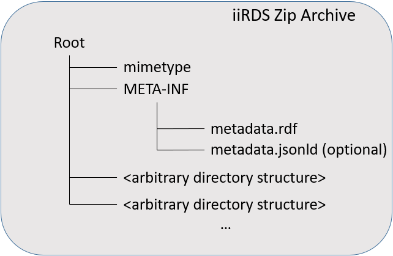

# iiRDS ZIP Archive

An <dfn>iiRDS ZIP archive</dfn> is an iiRDS container implementation using a ZIP archive, for example for transport and exchange between systems. The iiRDS ZIP archive is the default implementation of the iiRDS container. All processing applications <em title="MUST in RFC 2119 context" class="rfc2119">MUST</em> support this implementation\. 
The file name of the iiRDS ZIP archive <em title="MUST in RFC 2119 context" class="rfc2119">MUST</em> feature the file name extension `.iirds`.

<figure>
  
  <figcaption>iiRDS ZIP Archive Structure</figcaption>
</figure>

The ZIP archive file format is defined in [[!ZIP]].

In addition to the iiRDS container specifications, the root directory of the ZIP file <em title="MUST in RFC 2119 context" class="rfc2119">MUST</em> contain a file named `mimetype`. It <em title="MUST in RFC 2119 context" class="rfc2119">MUST</em> contain the following ASCII-encoded text in a single line, without any line delimiters such as `CR` or `LF`:

<pre>application/iirds+zip</pre>

The file <em title="MUST in RFC 2119 context" class="rfc2119">MUST</em> be the first entry in the ZIP file and it <em title="MUST in RFC 2119 context" class="rfc2119">MUST</em> be stored uncompressed \("Stored" mode\)\. By doing so, file types contained in iiRDS ZIP archives can be detected automatically without having to unpack the archive.

## Mimetype of iiRDS
iiRDS ZIP archives are associated with the MIME type `application/iirds+zip`.

## Content Encoding
In the ZIP archive, all file and directory names are UTF-8 encoded according to [[!ZIP]].

All other files in the ZIP are either uncompressed \("Stored" compression mode\) or compressed in "Deflated" mode. The ZIP archive <em title="MUST in RFC 2119 context" class="rfc2119">MUST</em> use the ZIP64&trade; extension [[!ZIP]] if the file size is bigger than 4 GB or the package has more than 65536 file entries\.

The iiRDS ZIP archive <em title="MUST NOT in RFC 2119 context" class="rfc2119">MUST NOT</em> be encrypted.
