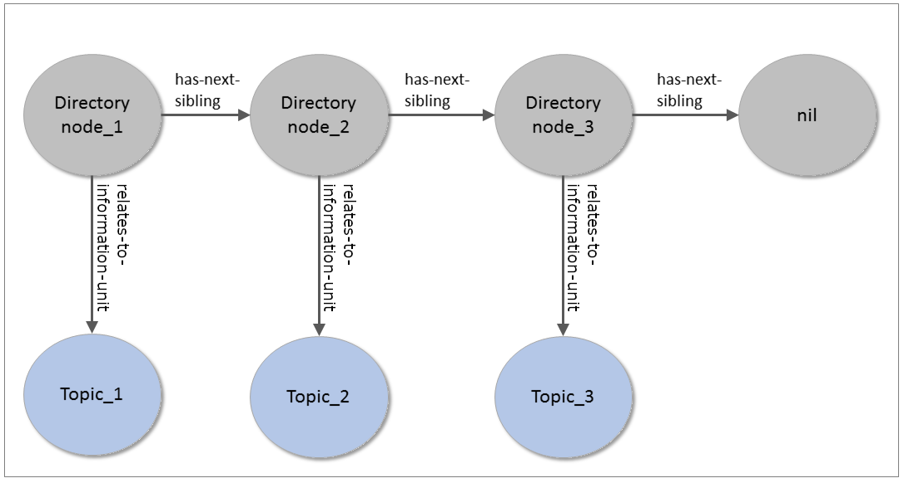

# Navigation

## Directory Nodes

Navigation sequences and hierarchies of InformationUnits <em title="MUST in RFC 2119 context" class="rfc2119">MUST</em> be modeled as linked lists of instances of the class `iirds:DirectoryNode`. In a linked list, an `iirds:DirectoryNode` references the following node by the property `iirds:has-next-sibling`. Each node of an iiRDS linked list <em title="MAY in RFC 2119 context" class="rfc2119">MAY</em> reference an `iirds:InformationUnit` by the property `iirds:relates-to-information-unit`.

To model closed lists, the last node in a list level <em title="MUST in RFC 2119 context" class="rfc2119">MUST</em> have the property `iirds:has-next-sibling` relating to an instance of the class `iirds:nil`\.

<aside class="example" title="Use cases for directory structures">

The directory node structure provides users with information on the context of the topic they are reading, its position in a document, its predecessors, and successors. In printed documentation, tables of contents usually provide this type of information.

</aside>

The property `iirds:has-directory-structure-type` determines the type of the directory structure. The root node of a directory structure <em title="MUST in RFC 2119 context" class="rfc2119">MUST</em> have one property `iirds:has-directory-structure-type`. Only root nodes of a directory structure <em title="MUST in RFC 2119 context" class="rfc2119">MUST</em> have the property `iirds:has-directory-structure-type`.

<pre class="example">
    
</pre>

    

        There is no direct relation between information units that represent navigation structures. For example, topic 1 has no direct relation to its successor topic 2. With no direct reference, iiRDS models reuse of information units in different contexts.
    

    

		iiRDS does not specify the inheritance of metadata between information units.
	

## Hierarchical Navigation
To model hierarchy levels in the navigation structure, an `iirds:DirectoryNode` instance <em title="MUST in RFC 2119 context" class="rfc2119">MUST</em> reference an `iirds:DirectoryNode` instance on the next lower level by the property `iirds:has-first-child`. The directory node on the next lower level <em title="MUST in RFC 2119 context" class="rfc2119">MUST</em> be the first item of another linked list.

<aside class="example" title="Table of contents">

The directory nodes of a table of contents form a tree-like structure. Each hierarchy level constitutes a linked list. The top-level is a linked list with only one element, the root node. To find the root node of a table of contents, query for all DirectoryNodes that satisfy the following conditions:

- Property `iirds:has-next-sibling` relates to `iirds:nil`
- Property `iirds:relates-to-information-unit` points to a document
- Property `iirds:has-directory-structure-type` relates to `iirds:TableOfContents`

</aside>

The property `rdfs:label` adds a title to a directory node\. Blank nodes are used to add navigation titles that do not represent a topic\.

<aside class="example" title="Table of contents">

The following example illustrates how to model a simple table of contents in iiRDS. The root node references a document and has a label. The additional label in the directory node structure overrules any title or label of the referenced information unit.

As the root directory node has no following sibling on the same hierarchy level, it forms a linked list with only one member\. To close the linked list with only one element, the root directory node has `iirds:nil` as the next sibling\. The next hierarchy level contains a linked list with directory nodes referencing chapter topic 1 and chapter topic 2\. The first directory node on chapter level has an additional label "Topic 1"\. The iiRDS Consumer uses the additional label for rendering in the directory structure\. The second directory node on chapter level has no additional label\. The iiRDS Consumer uses the title of the referenced information unit for rendering\. In this example, the instance topic\_2 has the title "Transportation"\.

Serialization in RDF 1.1 XML syntax:
<pre>
&lt;iirds:DirectoryNode rdf:about="http://myCompany.de/iirds/myPackage/manual_1"&gt;
    &lt;rdfs:label&gt;Table of Contents&lt;/rdfs:label&gt;
    &lt;iirds:relates-to-information-unit 
        rdf:resource="http://myCompany.de/iirds/myPackage/document"/&gt;  
    &lt;iirds:has-directory-structure-type 
        rdf:resource="http://iirds.tekom.de/iirds#TableOfContents" /&gt;
    &lt;iirds:has-first-child&gt;
        &lt;iirds:DirectoryNode&gt;
            &lt;iirds:relates-to-information-unit 
                rdf:resource="http://myCompany.de/iirds/myPackage/topic_1"/&gt;
            &lt;rdfs:label&gt;Topic 1&lt;/rdfs:label&gt;
            &lt;iirds:has-next-sibling&gt;
                &lt;iirds:DirectoryNode&gt;
                    &lt;iirds:relates-to-information-unit
                        rdf:resource="http://myCompany.de/iirds/myPackage/topic_2"/&gt;
                    &lt;iirds:has-next-sibling 
                        rdf:resource="http://iirds.tekom.de/iirds#nil"/&gt;
                &lt;/iirds:DirectoryNode&gt;
            &lt;/iirds:has-next-sibling&gt;            
        &lt;/iirds:DirectoryNode&gt;
    &lt;/iirds:has-first-child&gt;
    &lt;iirds:has-next-sibling rdf:resource="http://iirds.tekom.de/iirds#nil"/&gt;
&lt;/iirds:DirectoryNode&gt;
</pre>

Serialization in JSON-LD 1.1 syntax:
<pre>
"@graph": [
  {
    "@type": "iirds:DirectoryNode",
    "@id": "http://myCompany.de/iirds/myPackage/manual_1",
    "rdfs:label": "Table of Contents",
    "iirds:relates-to-information-unit": {
      "@id": "http://myCompany.de/iirds/myPackage/document"
    },
    "iirds:has-directory-structure-type": {
      "@id": "iirds:TableOfContents"
    },
    "iirds:has-first-child": {
      "@type": "iirds:DirectoryNode",
      "iirds:relates-to-information-unit": {
        "@id": "http://myCompany.de/iirds/myPackage/topic_1"
      },
      "rdfs:label": "Topic 1",
      "iirds:has-next-sibling": {
        "@type": "iirds:DirectoryNode",
        "iirds:relates-to-information-unit": {
          "@id": "http://myCompany.de/iirds/myPackage/topic_2"
        },
        "iirds:has-next-sibling": {
          "@id": "iirds:nil"
        }
      }
    },
    "iirds:has-next-sibling": {
      "@id": "iirds:nil"
    }
  }
]
</pre>

An iiRDS Consumer renders the `iirds:DirectoryNode` structure as follows:

    <h4 style="margin-top:0pt">Table of Contents</h4>
    

        
Topic 1

        
Transportation

    

</aside>
